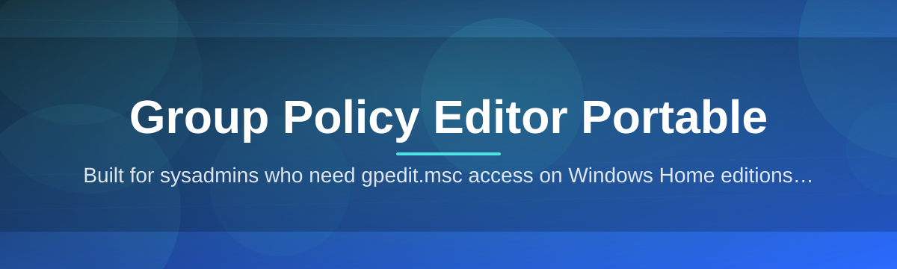

# grouppolicy-editor-portable 🛡️⚙️

  

*Local Group Policy, unlocked on every Windows edition — no installer, no console juggling.*

  

## 🧭 Overview

Windows ships its policy engine everywhere, but the graphical console to actually touch it — `gpedit.msc` — is quietly missing from Home editions and locked behind enterprise assumptions on Pro machines that were never joined to a domain. That gap forces people into registry hex-editing, PowerShell one-liners copied from forum threads, or third-party scripts of unknown origin just to disable a nagging setting or lock down a shared PC. It's a strange asymmetry: the policy engine is universal, the editor for it is not.

**grouppolicy-editor-portable** closes that gap with a single portable executable that reads and writes the same `registry.pol` structures the native console understands, wrapped in an interface that doesn't assume you have an Active Directory domain sitting behind you. It talks to Local Computer Policy and Local User Policy directly, renders the full ADMX/ADML template tree, and lets you flip settings with the same fidelity as the built-in tool — just without needing that tool to exist on your system first.

It's built for IT technicians provisioning kiosk machines, homelab tinkerers hardening a spare box, parents configuring a shared family PC, and sysadmins who need a quick policy edit on a Home-edition laptop without touching the registry by hand. If your workflow involves Group Policy Editor Portable as a go-to utility for local policy management, this is the tool meant to live on that USB stick next to your other portable admin utilities.

> [!NOTE]
> This project is a standalone GUI layered over Microsoft's native policy format. It does not modify Windows licensing, edition entitlements, or activation state — it simply gives you an editor where one wasn't shipped.

---

## 🔩 What It Actually Does

- **ADMX/ADML Template Rendering** — parses the full Microsoft policy definition tree (Computer Configuration, User Configuration, and every category folder Microsoft ships) so the setting list mirrors what you'd see on a domain-joined machine, not a stripped-down subset.

- **Home Edition Compatibility** — runs on editions where `gpedit.msc` was never installed, by shipping its own rendering layer instead of depending on a system component that isn't there.

- **Registry.pol Native I/O** — reads and writes directly to the binary `.pol` files Local Group Policy actually uses, meaning changes made here are recognized by `gpupdate` and Windows itself, not stored in a shadow format.

- **Zero-Footprint Portability** — a single executable, no installer, no service, no scheduled task left behind. Copy it, run it, delete it, and the machine looks exactly like it did before, minus the policy changes you chose to keep.

- **Search-First Navigation** — a live filter across thousands of policy names and descriptions, because scrolling nested tree folders to find "disable USB storage" is not how anyone wants to spend an afternoon.

- **Explain-Text Panels** — every setting shows its official Microsoft description, supported OS versions, and registry key mapping side by side, so you're never toggling something blind.

- **Snapshot & Revert** — export the current policy state before editing, so a batch of changes can be rolled back in one action if something behaves unexpectedly.

- **Offline by Design** — no telemetry, no update pings, no network calls required to browse or edit policy. Everything resolves from local template files bundled with the executable.

> [!TIP]
> Run a snapshot before any bulk policy session — even experienced admins occasionally toggle the wrong nested boolean three folders deep.

---

## 🚀 Getting Started

1. **Visit the landing page** using the download button above — this is the only distribution channel for the tool.

2. **Download the portable executable** — a single `.exe`, no bundled installer, no secondary downloader.

3. **Run it directly** from your Downloads folder, a USB drive, or a network share — no admin install step required to launch, though editing most policies still needs elevation.

4. **Browse or search** the policy tree, apply your changes, and let the tool write them straight to `registry.pol`.

> [!IMPORTANT]
> Some policy categories require the app to run with elevated privileges to persist changes. If a setting silently reverts after you close and reopen, relaunch as Administrator.

---

## 🖥️ System Requirements

| Requirement | Detail |
|---|---|
| OS | Windows 10 (1809+) or Windows 11, any edition |
| Architecture | x64 |
| Install footprint | None — fully portable, single executable |
| Dependencies | None — no .NET runtime install, no Visual C++ redistributables required |
| Admin rights | Recommended for writing most Computer Configuration policies |
| Disk space | Under 40 MB, templates included |

  

---

## 🏗️ How It Works

The tool's architecture separates three concerns that Microsoft's native console tightly couples: template parsing, policy storage, and UI rendering. That separation is exactly what lets it run without the OS component it's replacing.

1. **Template Load** — on launch, bundled ADMX/ADML files are parsed into an in-memory policy catalog, categorized and indexed for search.

2. **Store Detection** — the tool locates the Local Computer and Local User `registry.pol` files on disk and reads their current binary state.

3. **Diffing** — as you toggle settings in the UI, changes are held in a pending diff rather than written immediately, so nothing touches disk until you commit.

4. **Commit & Refresh** — on save, the diff is serialized back into `.pol` format and a policy refresh is triggered, so Windows picks up the change without a reboot in most cases.

5. **Persistence Check** — the tool re-reads the store post-write to confirm the setting stuck, flagging anything the OS silently rejected.

---

## 🧯 Troubleshooting

<strong>A setting I changed doesn't seem to apply</strong>

Run `gpupdate /force` from an elevated terminal, or reboot. Some policies are only re-evaluated at logon or on the next scheduled policy refresh cycle.

<strong>The app won't write changes at all</strong>

Relaunch as Administrator. Local Computer Configuration policies live under a protected registry hive that standard user tokens can't write to.

<strong>Some policies are grayed out or missing</strong>

Certain settings only apply to specific Windows editions or builds. The tool shows the full catalog but respects OS-level applicability flags baked into the ADMX metadata.

<strong>Windows Defender flagged the executable</strong>

Portable admin tools that write to system policy stores commonly trigger heuristic flags. Verify the download came from the official landing page linked in this README before proceeding.

<strong>Can I use this on a domain-joined machine?</strong>

You can, but domain Group Policy Objects pushed from a controller will typically override local policy on conflicting settings. This tool is aimed at local policy, not domain administration.

<strong>Does it work without an internet connection?</strong>

Yes. All templates are bundled locally — no network access is required to browse, search, or apply policy.

---

## 🎨 UI / UX Details

> [!TIP]
> Press `Ctrl+F` to jump into search from anywhere in the tree — the fastest way to find a specific policy among thousands.

| Shortcut | Action |
|---|---|
| `Ctrl+F` | Focus search bar |
| `Ctrl+S` | Commit pending changes |
| `Ctrl+Z` | Revert last uncommitted change |
| `F5` | Refresh policy state from disk |
| `Ctrl+E` | Export current snapshot |
| `Alt+Left/Right` | Navigate category history |

- **Dual-pane layout** — category tree on the left, setting detail and explain-text on the right, matching the mental model most admins already have.

- **Light and dark themes** — auto-detects Windows theme on first launch, switchable anytime from Settings.

- **Pending-change badges** — unsaved toggles are visually marked in the tree so nothing gets committed by accident.

- **Column-sortable setting lists** — sort by name, state (enabled/disabled/not configured), or category.

---

## 🤝 Contributing & Community

Bug reports, template coverage suggestions, and UI feedback are welcome through the project's issue tracker. If you spot a policy category that renders incorrectly or a description that doesn't match Microsoft's official documentation, that's exactly the kind of report that improves this for everyone.

> [!WARNING]
> Please don't submit unofficial or modified ADMX templates in pull requests — the project only ships templates sourced directly from Microsoft's official policy definitions to keep behavior predictable.

- Star the repo if this saved you a registry-editing headache.
- Open an issue with your Windows build number if a setting behaves unexpectedly.
- Discussions are the right place for "how do I configure X" questions.

---

## 📜 License

Released under the [MIT License](LICENSE), 2026. Use it, fork it, embed it in your own admin toolkit — just keep the license notice intact.

---

## ⚠️ Disclaimer

This tool is provided as-is for legitimate local system administration. It does not alter Windows licensing terms, edition entitlements, or activation state, and it is not affiliated with or endorsed by Microsoft. Always back up your system state before making bulk policy changes — the maintainers are not responsible for configuration outcomes on production or shared machines.

